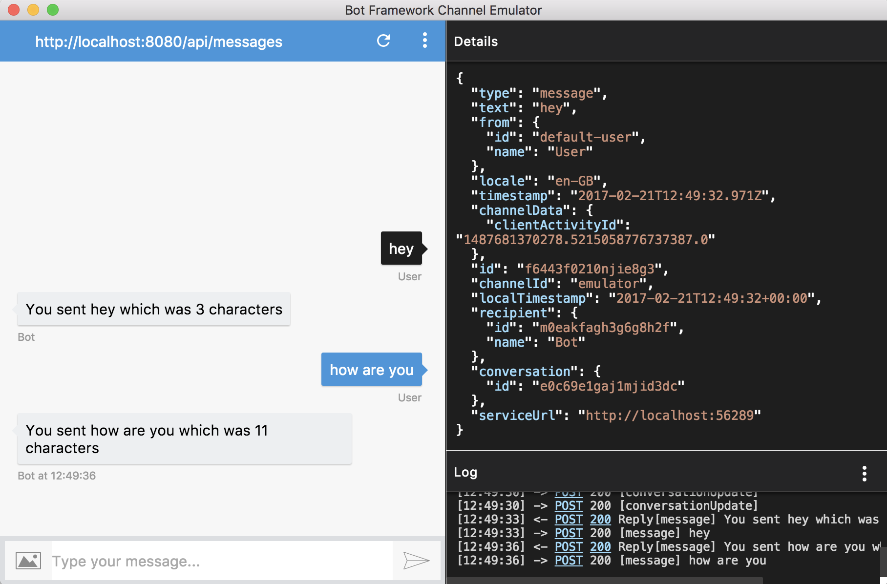

# MyFirstBot

As currently there is not a Bot Framework template for Visual Studio Mac, use this bot at your starting application for developing a C# bot on OSX. 

- Open this solution in [Visual Studio for Mac Preview](https://www.visualstudio.com/vs/visual-studio-mac)
- Restore all packages
- Build and run the application

When the application launches, you may see a 404 Error `System.Web.HttpException. The resource cannot be found`. Don't worry about this for now as the application still works and this doesn't prevent you from completing the lab.

Also notice your app is using port 8080. Keep a note of this as you will need to use this address in the bot emulator to communicate with your bot: `http://localhost:8080/api/messages`

